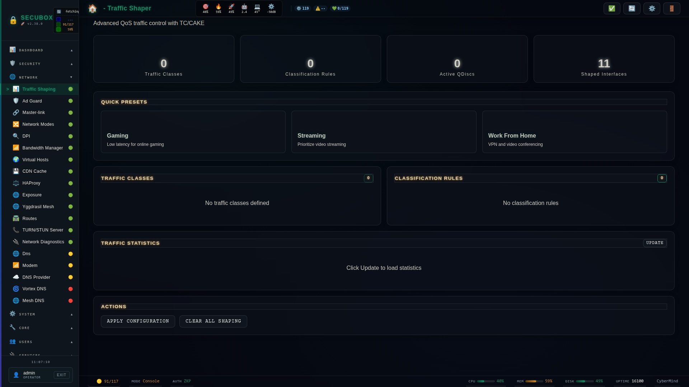

<!--
  SPDX-License-Identifier: LicenseRef-CMSD-1.0
  Copyright (c) 2026 CyberMind — Gérald Kerma <devel@cybermind.fr>
  Source-Disclosed License — All rights reserved except as expressly granted.
  See LICENCE-CMSD-1.0.md for terms.
-->

# 📈 Traffic Shaping

TC/CAKE traffic shaping

**Category:** Network

## Screenshot



## Features

- Per-interface QoS
- CAKE algorithm
- Statistics
- Real-time graphs

## Installation

```bash
# Add SecuBox repository
curl -fsSL https://apt.secubox.in/install.sh | sudo bash

# Install package
sudo apt install secubox-traffic
```

## Configuration

Configuration file: `/etc/secubox/traffic.toml`

## API Endpoints

- `GET /api/v1/traffic/status` - Module status
- `GET /api/v1/traffic/health` - Health check

## License

LicenseRef-CMSD-1.0 (Source-Disclosed License) — CyberMind © 2024-2026.
See [LICENCE-CMSD-1.0.md](../../LICENCE-CMSD-1.0.md).
