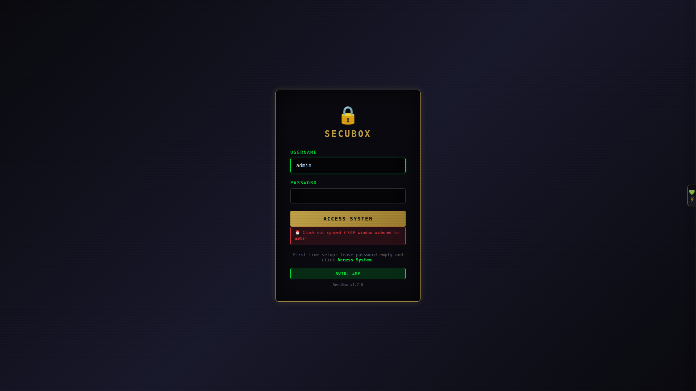

# 🛡️ Vortex DNS

DNS firewall with RPZ blocklists

**Category:** DNS

## Screenshot



## Features

- Blocklists
- RPZ
- Threat feeds
- DoH/DoT

## Installation

```bash
# Add SecuBox repository
curl -fsSL https://apt.secubox.in/install.sh | sudo bash

# Install package
sudo apt install secubox-vortex-dns
```

## Configuration

Configuration file: `/etc/secubox/vortex-dns.toml`

## API Endpoints

- `GET /api/v1/vortex-dns/status` - Module status
- `GET /api/v1/vortex-dns/health` - Health check

## License

LicenseRef-CMSD-1.0 (Source-Disclosed License) — CyberMind © 2024-2026.
See [LICENCE-CMSD-1.0.md](../../LICENCE-CMSD-1.0.md).
