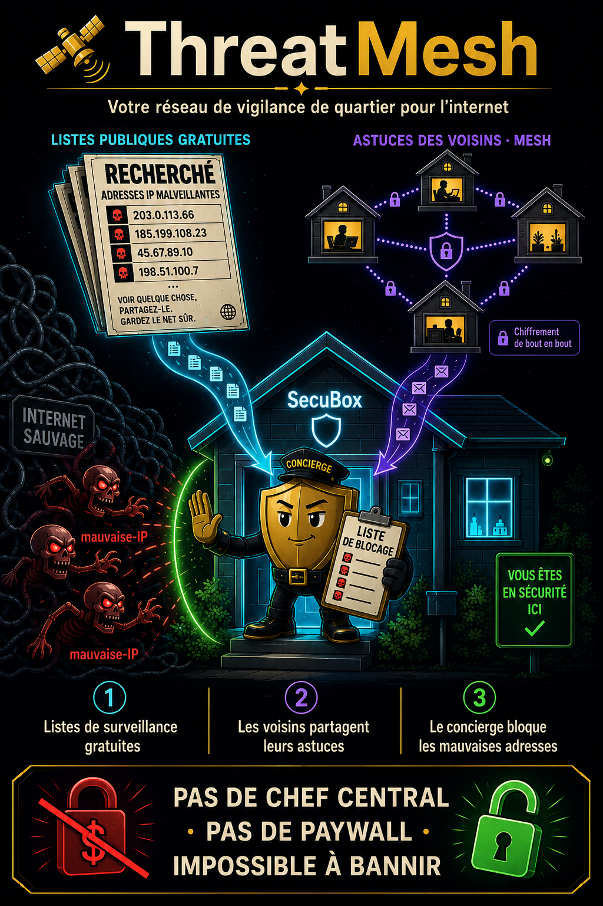

<!--
  SPDX-License-Identifier: LicenseRef-CMSD-1.0
  Copyright (c) 2026 CyberMind — Gérald Kerma <devel@cybermind.fr>
  Source-Disclosed License — All rights reserved except as expressly granted.
  See LICENCE-CMSD-1.0.md for terms.
-->

# ThreatMesh 🛰️

[EN](ThreatMesh) | **[FR](ThreatMesh-FR)** | **🔴 BOOT · 🛡️ SÉCURITÉ** | renseignement de menace souverain

> Votre réseau de vigilance de quartier pour l'internet — *listes gratuites + astuces des voisins, sans chef central, sans paywall, impossible à bannir.*



ThreatMesh est la couche SecuBox qui **bloque automatiquement les adresses
internet malveillantes connues** — née après que l'API centrale de CrowdSec
(CAPI) a blacklisté l'IP de notre box puis fait payer le déblocage. Elle
remplace cette dépendance centrale par des **listes publiques auto-sourcées**
plus un **partage d'astuces pair-à-pair** entre vos propres box. Vous possédez
toute la chaîne, de bout en bout.

---

## 🏘️ L'idée simple

Voyez votre SecuBox comme une **maison avec un concierge malin**. Le concierge
tient une seule liste « à ne pas laisser entrer », alimentée par deux flux, et
refuse tout ce qui y figure.

```
   LISTES « RECHERCHÉ » GRATUITES        VOS AUTRES BOX (mesh)
   (bulletins publics)                  (voisins qui s'échangent des astuces)
            \                                /
             \                              /
              ▼                            ▼
          ┌──────────────────────────────────┐
          │  LE CONCIERGE — une liste de       │
          │  blocage, ne croit que les bonnes  │
          │  pistes                            │
          └──────────────────────────────────┘
                          │
                          ▼
              🚪 une mauvaise adresse frappe → REFUSÉE
```

1. **📋 Listes de surveillance gratuites** — toutes les 6 h la box récupère des
   listes publiques « ces IP sont dangereuses » (C2 de malware, réseaux
   détournés, attaquants connus). Gratuit, sans inscription, sans compte.
2. **🤝 Astuces des voisins (mesh)** — quand *votre* box attrape un attaquant,
   elle prévient vos *autres* box via le mesh chiffré SecuBox (WireGuard). Sans
   intermédiaire.
3. **🛡️ Le concierge agit** — chaque astuce atterrit dans une seule liste de
   blocage et la box refuse le trafic vers/depuis ces adresses au pare-feu
   (nftables).

---

## 🆚 Pourquoi souverain

| Avant (CrowdSec CAPI) | Maintenant (ThreatMesh) |
|------------------------|-------------------------|
| La liste centrale d'une entreprise | **La vôtre**, depuis des sources ouvertes |
| Ils peuvent **bannir votre IP** | **Personne ne peut vous exclure** |
| **Payer** pour être débanni | **Gratuit, pour toujours** |
| Vous dépendez d'eux | **Vous possédez toute la chaîne** |

Le moteur de détection hors-ligne de CrowdSec (LAPI) est conservé — seul le flux
central toxique (CAPI) est abandonné.

---

## 🔍 Sous le capot

| Étape | Composant | Rôle |
|-------|-----------|------|
| **Feeds** | `secubox-threatfeed` (timer, 6 h) | tire des listes gratuites — feodo, sslbl, FireHOL, Spamhaus DROP, blocklist.de, CINS, ET-compromised, DShield — dans la table partagée `threat_intel` |
| **Mesh** | `secubox-threatmesh` (service) | diffuse les décisions détectées localement aux pairs du mesh via WireGuard ; ingère les décisions des pairs (`mesh:<node>`), comptées par consensus ; port `:8780` verrouillé au mesh par nftables |
| **Application** | `secubox-blacklist-sync` | vide `threat_intel` → ensembles de drop nft `blacklist_v4/v6` |
| **Visualiser** | tableau de bord `/threatmesh/` + `/api/v1/threatmesh/decisions` (compatible bouncer CrowdSec) | statut, sources, pairs, IP à plus fort consensus |

### 🎯 La porte de confiance (zéro carpet-bomb de faux positifs)

Les feeds publics agrégés contiennent beaucoup d'entrées bruyantes à source
unique. ThreatMesh **n'applique le blocage** que si une IP est **corroborée par
≥ 2 sources** *ou* provient d'un **feed curé de haute confiance** (poids ≥ 80).
Le reste reste *visible mais non bloqué*. Les décisions locales de CrowdSec et le
DNS-guard sont toujours appliqués.

Réglage via variables d'env sur `secubox-blacklist-sync` :

```
SECUBOX_BL_MIN_CONSENSUS=2   # sources qui doivent concorder (plus bas = plus de couverture)
SECUBOX_BL_MIN_WEIGHT=80     # niveau de confiance qui contourne la règle de consensus
```

---

## 📊 En un coup d'œil

- **~45 000** IP dangereuses connues (rafraîchies toutes les 6 h)
- **~3 000** IP de haute confiance bloquées activement au pare-feu
- Le partage mesh s'active tout seul dès qu'une seconde SecuBox rejoint le mesh
- **0** compte externe · **0** paywall · **0** moyen pour un tiers de vous couper

> *Ils nous ont bloqués et ont demandé de l'argent pour débloquer. Alors on a construit le nôtre — et maintenant personne ne peut nous couper.* 🔓

---

*Voir aussi : [[Anti-Track]] · [[Architecture]] · `secubox-threatmesh` (#728)*
