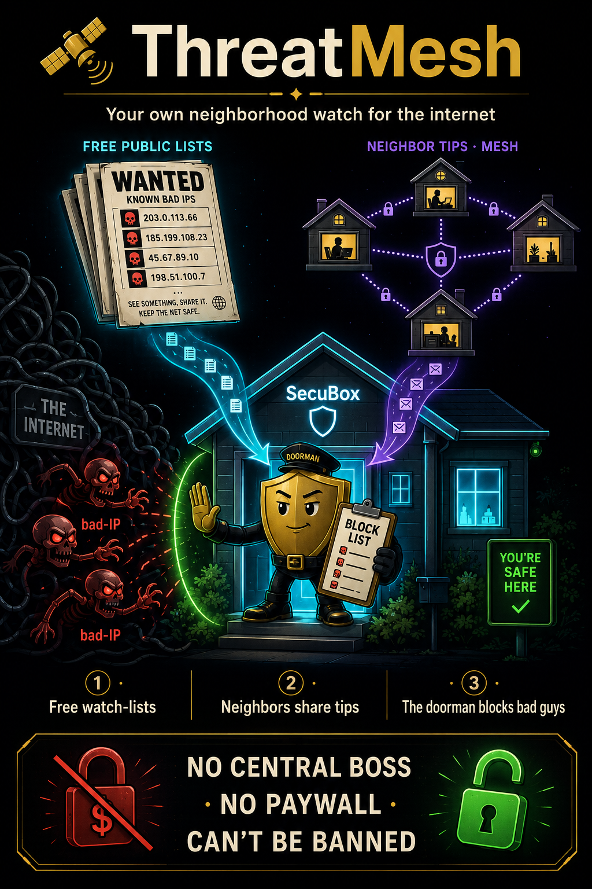

<!--
  SPDX-License-Identifier: LicenseRef-CMSD-1.0
  Copyright (c) 2026 CyberMind — Gérald Kerma <devel@cybermind.fr>
  Source-Disclosed License — All rights reserved except as expressly granted.
  See LICENCE-CMSD-1.0.md for terms.
-->

# ThreatMesh 🛰️

**[EN](ThreatMesh)** | [FR](ThreatMesh-FR) | **🔴 BOOT · 🛡️ SECURITY** | sovereign threat-intel

> Your own neighborhood watch for the internet — *free feeds + neighbor tips, no central boss, no paywall, can't be banned.*



ThreatMesh is the SecuBox layer that automatically **blocks known-bad internet
addresses** on its own — built after CrowdSec's central API (CAPI) IP-blocklisted
our box and paywalled the un-blocking. It replaces that central dependency with
**self-sourced public lists** plus **peer-to-peer tip sharing** between your own
boxes. You own the whole thing end to end.

---

## 🏘️ The simple idea

Think of your SecuBox as a **house with a smart doorman**. The doorman keeps one
"do not let in" list, fed by two streams, and turns away anything on it.

```
   FREE "WANTED" LISTS              YOUR OTHER BOXES (mesh)
   (public bulletins)              (neighbors swapping tips)
            \                              /
             \                            /
              ▼                          ▼
          ┌──────────────────────────────────┐
          │   THE DOORMAN — one block list,   │
          │   only trusts solid tips          │
          └──────────────────────────────────┘
                          │
                          ▼
              🚪 bad address knocks → DROPPED
```

1. **📋 Free watch-lists** — every 6 h the box pulls public "these IPs are
   dangerous" lists (malware C2, hijacked networks, known attackers). Free, no
   sign-up, no account.
2. **🤝 Neighbor tips (mesh)** — when *your* box catches an attacker it tells your
   *other* boxes over the encrypted SecuBox mesh (WireGuard). No middleman.
3. **🛡️ The doorman acts** — every tip lands in one block-list and the box
   refuses traffic to/from those addresses at the firewall (nftables).

---

## 🆚 Why sovereign

| Before (CrowdSec CAPI) | Now (ThreatMesh) |
|------------------------|------------------|
| One company's central list | **Your own**, from open sources |
| They can **ban your IP** | **No one can lock you out** |
| **Pay** to get un-banned | **Free, forever** |
| You depend on them | **You own the whole pipeline** |

CrowdSec's offline detection engine (LAPI) is kept — only the toxic central feed
(CAPI) is dropped.

---

## 🔍 Under the hood

| Stage | Component | What it does |
|-------|-----------|--------------|
| **Feeds** | `secubox-threatfeed` (timer, 6 h) | pulls free lists — feodo, sslbl, FireHOL, Spamhaus DROP, blocklist.de, CINS, ET-compromised, DShield — into the shared `threat_intel` table |
| **Mesh** | `secubox-threatmesh` (service) | gossips locally-detected decisions to mesh peers over WireGuard; ingests peer decisions (`mesh:<node>`), consensus-counted; port `:8780` locked to the mesh by nftables |
| **Enforce** | `secubox-blacklist-sync` | drains `threat_intel` → nft `blacklist_v4/v6` drop sets |
| **See it** | `/threatmesh/` dashboard + `/api/v1/threatmesh/decisions` (CrowdSec-bouncer-compatible) | status, sources, peers, top-consensus IPs |

### 🎯 The confidence gate (no false-positive carpet-bomb)

Aggregated public feeds carry many noisy single-source entries. ThreatMesh
**only enforces** an IP that is **corroborated by ≥ 2 sources** *or* comes from a
**curated high-trust feed** (weight ≥ 80). The rest stay *visible but not
blocked*. CrowdSec local decisions + DNS-guard are always enforced.

Tune via env on `secubox-blacklist-sync`:

```
SECUBOX_BL_MIN_CONSENSUS=2   # sources that must agree (lower = more coverage)
SECUBOX_BL_MIN_WEIGHT=80     # trust level that bypasses the consensus rule
```

---

## 📊 At a glance

- **~45 000** dangerous IPs known (refreshed every 6 h)
- **~3 000** high-confidence IPs actively dropped at the firewall
- Mesh sharing lights up automatically when a second SecuBox joins the mesh
- **0** external accounts · **0** paywall · **0** ways for a third party to switch you off

> *They blocked us and asked for money to unblock. So we built our own — and now nobody can switch us off.* 🔓

---

*See also: [[Anti-Track]] · [[Architecture]] · `secubox-threatmesh` (#728)*
